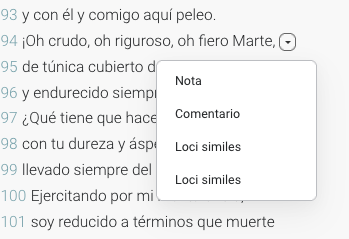
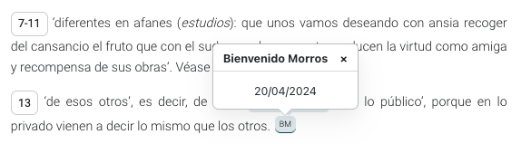

# Indicaciones para los editores 

Cada editor debe ser responsable de revisar con mucha antención la versión web de la composición que ha editado. Esta revisión es tan crucial como cuando os mandan las primeras pruebas de maquetación. El texto nunca se revisa lo sufiente. Para llevar a cabo estas revisiones y también para faciliatar la codificación posterior de los textos, es conveniente que la redacción se adapte a una serie de convenciones. 

Recordad que la edición es una versión beta, así que agradeceríamos también cualquier idea que pueda facilitar la comprensión y navegación de la edición digital, así como a su mejora en su diseño web. 

Sería interesante que los editores tuvieran en mente la codificación en XML-TEI que se lleva a cabo de sus textos <https://github.com/susannalles/pronapoli/blob/gh-pages/docs.md>. 

## El texto poético

El texto poético aparece siempre a la izquierda de la pantalla, normalmente sin separación de estrofas, y con todos los números de los versos indicados. En principio, no hay tabulaciones diferentes en función del núemro o tipo de verso. 

Cada verso puede contener un pequeño icono en donde aparecen, en caso de haberlos, las referencias a: Notas, Comentarios y Loci Similes. 



## Notas, Comentarios, Loci similes 

Cada nota, comentario o loci similes va seguido de un icono que indica la responsabilidad intelectual de la nota y siempre aparece al final de la nota. La responsabilidad puede ser de uno o más editores, y en todo caso se firma conjuntamente (es decir, no puede haber un párrafo firmado por un editor y el siguiente párrafo por otro). 



Cada Nota, Comentario o Loci similes va precedido por el número de verso al que hace referencia; este número es clicable y subraya el verso en cuestión. A continuación, puede o no aparecer la palabra o palabras del verso al que la nota hace referencia; esta referencia aparece en un color turquesa. 

## Enlaces

A lo largo de todas las secciones de la edición pueden aparecen enlaces. Es importante que se señale siempre dónde apuntan: 

- Si es un enlace exterlo, debe añadirse toda la URL. Ej. La Venus de Nilo <https://es.wikipedia.org/wiki/Venus_de_Milo>
- Si es un enlace dentro de la página de Pronapoli, también debe indicarse la URL completa.
- Si se hace referencia a una Nota, un Comentario, o un Loci simile debe indicarse exactamente el número de verso. Por ejemplo, en la [Elegía II](https://pronapoli.com/ediciondigital/elegia2), Nota vv. 1-2, aparece un enlace a Loci simili vv. 1-2. En este caso, el editor debe señalarlo así "Loci simili vv. 1-2". 

## Referencias bibliográficas secundarias

Las referencias bibliográficas secundarias se marcan todas en un elemento XML-TEI llamado `<bibl>` y aparecen después en HTML (en la versión web) con un fondo gris. Si se pasa el cursor por arriba aparece una "pop-up" que dice "Referencia Bibliográfica". Es importante que estas referencias en el cuerpo del texto aparezcan siempre completas (Autor año: página) porqué la idea es poder otorgarles un identificador y recuperarlas de manera automática para después crear la bibliografía. Es decir, aunque se mencione el autor unas líneas más arriba, de igual manera ese paréntesis debe estar completo con toda la información.  


## Referencias bibliográficas primarias y citas

Las referencia bibliográficas primarias, ya sean fuentes clásicas o contemporáneas al autor, también aparecen en fondo gris pero la pop-up. Si la referencia va acompañada de una cita textual, esta aparece en un fondo azul: 


Todas estas referncias y citas primarias se marcan en XML para que después puedan recuperarse y hacer algunas estadísticas. Por ejemplo, ¿qué porcentaje hay de Cicerón, o de Virgilio, o de Horario? Por ello es muy importante que todos sigamos una misma manera de citas y que siempre aprezca claramente el autor. En la imagen anterior aparece un ejemplo correcto y de fácil recuperación: 

```
"Cita" Autor, Título abreviado, libro, verso
```
Editores: Revisad que todos los colores aparecen correctamente (azul para citas, fondo gris para referencias bibliográficas). Poned atención si se detectan doblen camillas en las citas. 

## Aparto crítico 

El modelo a seguir es el de la [Elegía II](https://pronapoli.com/ediciondigital/elegia2). Primero se indica el término o lema (que aparece en turquesa) seguido de la variante y de los testimoinos que incluyen esa variante. En una línea diferente se incluye cualquier tipo de nota explicativa ya sea sobre esa variante, sobre otros testimonios, la justificación del editor, etc. 

```txt
número de verso + lema + variantes + testimonios 
nota en un nuevo párrafo
```

Como aparece en la siguiente imágen: 


## Otros consejos 

- Comprobad que las cursivas que habíais puesto en vuestros documentos se mantienen en la versión web.
- Comprobad que no haya ninguna paralabra o fragmento en rojo. Si algo aparece en rojo, es que hemos detectado un error.
- Compropad que todos los enlaces funcionan (se nos puede haber escapado alguno o que haya algún error).
- Cuando se mandan las revisiones, por favor, seguid el modelo: 

```txt
Em la Composición <http//enlace>, sección X, Nota VV. 51-51: donde dice "bla bla" debe decir "ble ble".
En la Canción V, https://pronapoli.com/ediciondigital/cancion5, sección Notas 61-62: donde dice "de la tierra al sembrarla" debe decur "del cielo a la tierra".
En la Oda II, https://pronapoli.com/ediciondigital/oda2, sección Contexto, 2 párrafo: donde dice "un expediente" debe decir "un experimento".  
```

